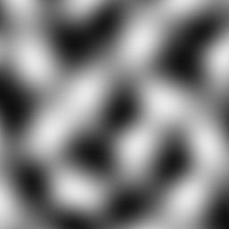

# Heightmaps

A collection of heightmap generators, along with some bmp/ppm image format savers. 

	
	
	

No external libraries have been used (except for the SDL C library), so this project will hopefully serve as a good reference source for a raw F# implementation of these algorithms.

Currently, [Diamond Square](https://en.wikipedia.org/wiki/Diamond-square_algorithm), [Perlin noise](https://en.wikipedia.org/wiki/Perlin_noise) and [Simplex noise](https://en.wikipedia.org/wiki/Simplex_noise) have been implemented, with the [PPM format (P6)](https://en.wikipedia.org/wiki/Netpbm_format), [BMP format (24bit)](https://en.wikipedia.org/wiki/BMP_file_format) and a [SDL](https://en.wikipedia.org/wiki/Simple_DirectMedia_Layer) renderer. You can find the implementations of each in the appropriately named F# files - each file is completely self contained.

The project is a console app. It will take command-line arguments to configure (instructions can be seen by running it with 'help', or seeing the definition in the code [here](https://github.com/ChrisPritchard/Heightmaps/blob/master/Program.fs#L45).

If -bitmap or -ppm is *not* specified, the default is to render the generated image on a SDL surface. If so, the image can be regenerated using the R key, or the program can be quit using the escape key.

NOTE: some safe defaults, like the range reduction in diamond square and the perlin noise period cannot be set using the CLI tool. However, the algorithms are generally written so these variables are easy to override if needed.

The version of SDL shipped with this is for 64bit windows. Replacing the SDL.dll file with versions for other operating systems should work fine. Other versions can be found [here](https://www.libsdl.org/download-2.0.php).
